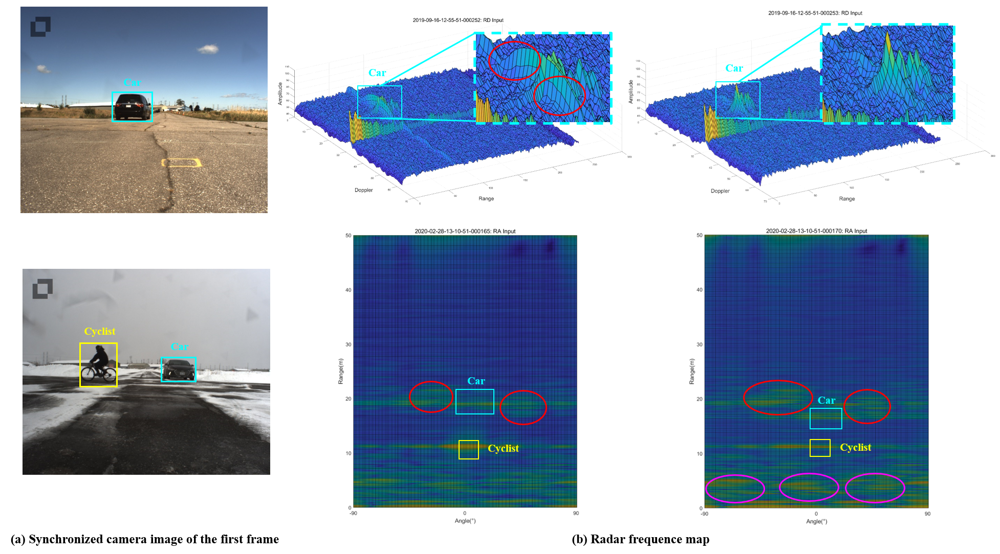
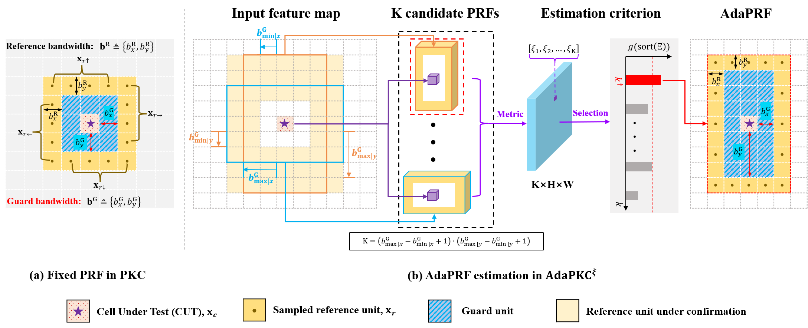
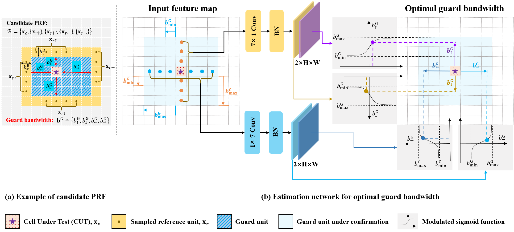
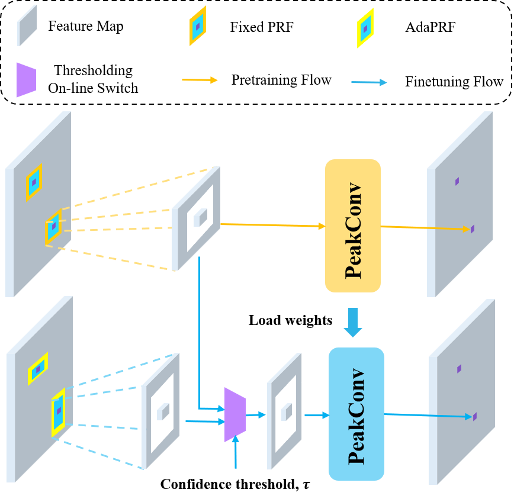

# AdaPKC: PeakConv with Adaptive Peak Receptive Field for Radar Semantic Segmentation
## Authors
[Teng Li](https://github.com/lihua199710)\*, [Liwen Zhang](https://github.com/zlw9161)\*, Youcheng Zhang, et al., AdaPKC: PeakConv with Adaptive Peak Receptive Field for Radar Semantic Segmentation, accepted by NeurIPS 2024 (* Equal Contributions).

## Brief introductions of the paper

1. We illustrate the observed variations in target signatures and interfering signals in the radar frequency map as follows.


2. To achieve consistent interference (noise/clutter) suppression under the dynamic and time-varying nature of radar signals, we first propose an updated version of PKC, named $\text{AdaPKC}^{\xi}$.


3. We also propose another updated version of PKC, named $\text{AdaPKC}^{\theta}$.


4. To better release the learning ability of AdaPKC, we propose a fine-tuning technology, termed as FiTOS.



## Basic description of the code

This repository contains the implementation of AdaPKC including $\text{AdaPKC}^{\xi}$, accelerated $\text{AdaPKC}^{\xi}$, $\text{AdaPKC}^{\theta}$, and $\text{AdaPKC}^{\xi}$ w/ FiTOS, where accelerated $\text{AdaPKC}^{\xi}$ is an accelerated version of $\text{AdaPKC}^{\xi}$ for both training and inference.

- The model definition files are located in `AdaPKC/adapkc/models`, where `adapkc_xi.py` defines $\text{AdaPKC}^{\xi}$ and $\text{AdaPKC}^{\xi}$ w/ FiTOS, `adapkc_xi_faster.py` defines accelerated $\text{AdaPKC}^{\xi}$ and `adapkc_theta.py` defines $\text{AdaPKC}^{\theta}$;
- The detailed test results of AdaPKC-Net in submitted paper are provided at `AdaPKC/test_results`:
	- Results for $\text{AdaPKC}^{\xi}$ w/ FiTOS: see `AdaPKC/test_results/metrics_adapkc_xi_fitos.json`;
	- Results for $\text{AdaPKC}^{\theta}$: see `AdaPKC/test_results/metrics_adapkc_theta.json`;

## Dataset

The models are trained and tested on the [CARRADA dataset](https://arxiv.org/abs/2005.01456), its calibrated version [CARRADA-RAC dataset](https://ieeexplore.ieee.org/document/10204655), and the KuRALS dataset (released soon).

* The CARRADA dataset is available on Arthur Ouaknine's personal web page at this link: [https://arthurouaknine.github.io/codeanddata/carrada](https://arthurouaknine.github.io/codeanddata/carrada).

* The CARRADA-RAC code can be found at [CARRADA-RAC](https://github.com/zlw9161/CARRADA-RAC).

* Our KuRALS dataset will be released for research purposes soon.

## Installation

We provide instructions on how to install dependencies via conda and pip:

1. Create and activate a new conda environment:
```bash
$ conda create -n adapkc python=3.7
$ conda activate adapkc
```

2. Git clone this repository and install it using pip:
```bash
$ git clone https://github.com/lihua199710/AdaPKC
$ cd AdaPKC/
$ pip install -e .
```
With this, you can edit the AdaPKC code on the fly and import function and classes of AdaPKC in other projects as well.

3. Install pytorch using conda:
```bash
$ conda install pytorch==1.10.1 torchvision==0.11.2 torchaudio==0.10.1 cudatoolkit=11.3 -c pytorch -c conda-forge
```

4. (Optional) Install correlation package for the usage of accelerated $\text{AdaPKC}^{\xi}$: First assign the python path of the `adapkc` conda environment, such as `home/miniconda/envs/adapkc/include/python3.7m`, to `include_dirs` in [adapkc/correlation/setup.py](./adapkc/correlation/setup.py). Then run the following command lines:
```bash
$ pip install ninja
$ cd adapkc/correlation
$ python setup.py install
```

5. Install other dependencies using pip:
```bash
$ pip install -r requirements.txt
```

6. (Optional) To uninstall this package, run:
```bash
$ pip uninstall AdaPKC
```

## Usage

In any case, it is **mandatory** to specify beforehand both the path where the CARRADA or CARRADA-RAC dataset is located and the path to store the logs and models. For example: I put the Carrada folder in /home/datasets_local, the path I should specify is /home/datasets_local. The same way if I store my logs in /home/logs. Please run the following command lines while adapting the paths to your settings:

```bash
$ cd adapkc/utils/
$ python set_paths.py --carrada /home/datasets_local --logs /home/logs
```

### Training

In order to train a model, a JSON configuration file should be set. The configuration file corresponding to the selected parameters to train $\text{AdaPKC}^{\xi}$, accelerated $\text{AdaPKC}^{\xi}$, $\text{AdaPKC}^{\theta}$, and $\text{AdaPKC}^{\xi}$ w/ FiTOS architecture is provided in: `AdaPKC/adapkc/config_files/adapkc_xi.json`, `AdaPKC/adapkc/config_files/adapkc_xi_faster.json`, `AdaPKC/adapkc/config_files/adapkc_theta.json` and `AdaPKC/adapkc/config_files/adapkc_finetune.json`, respectively. For example, to train the AdaPKC-Theta architecture, please run the following command lines:

```bash
$ cd AdaPKC/adapkc/
$ bash train.sh
```

### Testing

To test a recorded model, you should specify the configuration file and the path of model weights. For example, if you want to test the $\text{AdaPKC}^{\theta}$ model and the model weights have been saved to `/home/logs/carrada/adapkc_theta/name_of_the_model/results/model.pt`, you should assign this path to `model-path` in [test.sh](./adapkc/test.sh). This way, you should execute the following command lines:

```bash
$ cd AdaPKC/adapkc/
$ bash test.sh
```
Note: the current implementation of this script will not generate qualitative results in your log folder. You can enable this behavior by setting `get_quali=True` in the parameters of the `predict()` method of the `Tester()` class.


## Acknowledgements
- Thank [CARRADA dataset](https://arxiv.org/abs/2005.01456) for providing the CARRADA dataset.
- Thank [PKC](https://ieeexplore.ieee.org/document/10204655) for providing the CARRADA-RAC code.
- Thank [MVRSS](https://arxiv.org/abs/2103.16214) and [PKC](https://ieeexplore.ieee.org/document/10204655) for providing the basic model framework of multi-view RSS network. 
- The paper is accepted by NeurIPS 2024. The camera-ready paper for AdaPKC is coming soon, and we will provide the long extension version on arxiv.

## License
The AdaPKC repo is released under the Apache 2.0 license.
